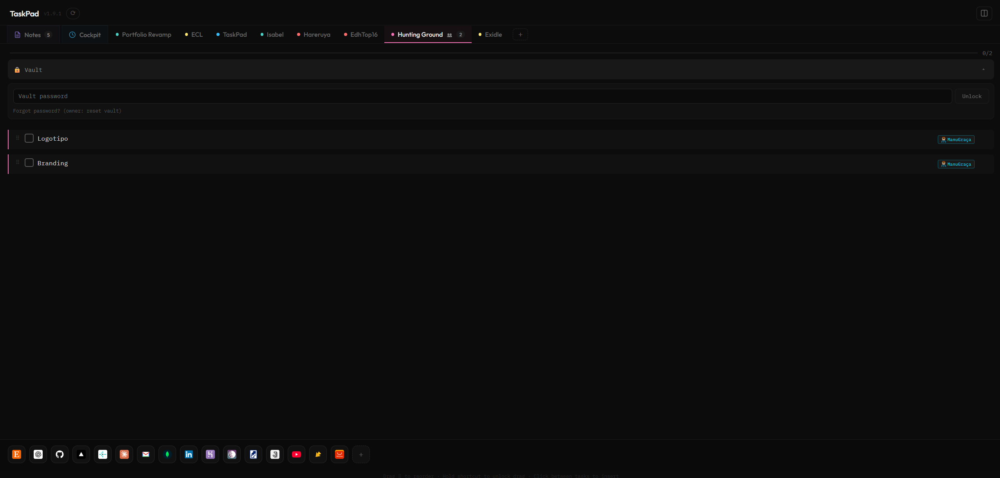
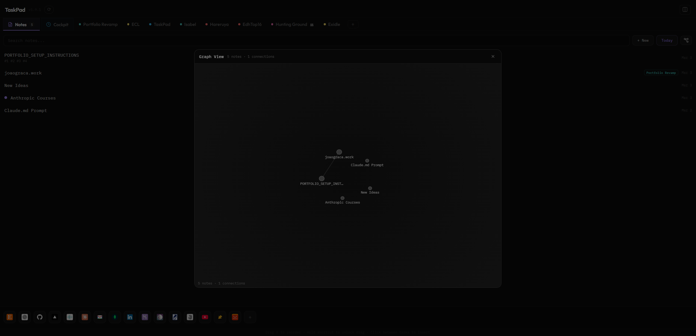
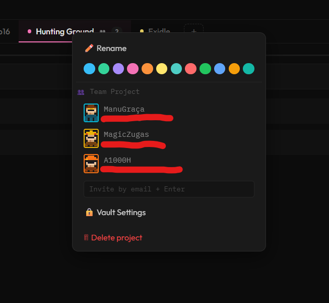
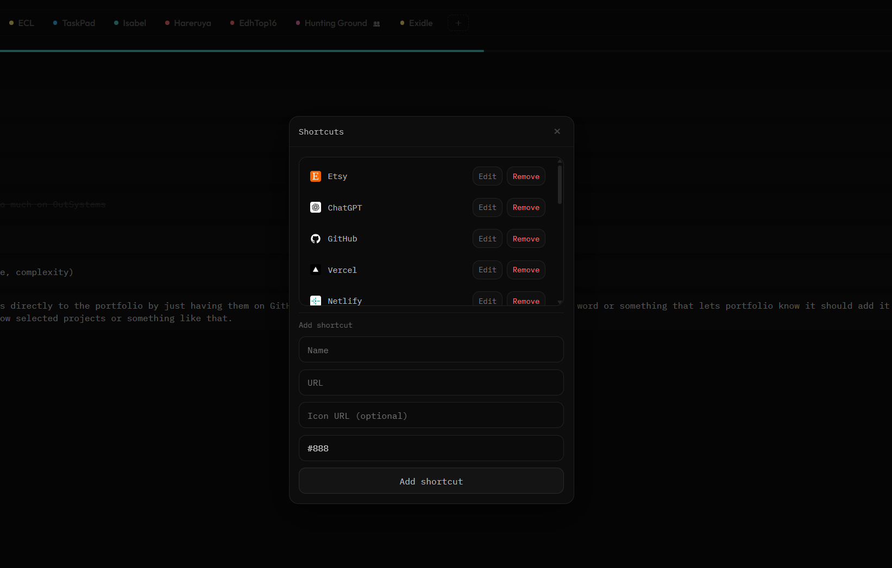

<div align="center">

# TaskPad

**Your tasks, everywhere — PWA and desktop in one codebase.**

A lightning-fast task manager built for speed and real-time collaboration. Local-first optimistic updates keep the UI instant while Firestore syncs everything in the background.

[](https://taskpad-phi.vercel.app/)
[](https://react.dev)
[](https://vitejs.dev)
[](https://firebase.google.com)
[](https://tauri.app)

</div>

---

<div align="center">

</div>

<br/>

## Highlights

- **Local-first** — Optimistic updates with debounced cloud sync. Works fully offline.
- **Real-time collaboration** — Shared team projects with live task sync across all members.
- **Encrypted vault** — AES-256-GCM password vault per team, end-to-end encrypted client-side.
- **Notes with Markdown** — Full notes system with wikilinks, graph view, slash commands, and templates.
- **Cross-platform** — Ships as an installable PWA (Vercel) and native desktop app (Tauri) from one codebase.
- **Zero dependencies for state** — No Redux, no Context API, no React Router. Pure React hooks.

---

## Screenshots

<div align="center">
<table>
<tr>
<td width="50%" align="center">

<br/><sub><b>Notes & Graph View</b> — Wikilink-connected notes with force-directed graph</sub>
</td>
<td width="50%" align="center">

<br/><sub><b>Team Collaboration</b> — Pixel-art avatars, invites, and vault settings</sub>
</td>
</tr>
<tr>
<td colspan="2" align="center">

<br/><sub><b>Shortcut Bar</b> — Customizable quick-access links with drag reordering</sub>
</td>
</tr>
</table>
</div>

---

## Features

### Task Management
- Create, edit, and delete tasks with inline editing
- Drag-and-drop reordering with smooth animations
- Multi-select tasks (Ctrl+Click, drag-select, or long-press on mobile)
- Batch copy and batch delete selected tasks
- Undo deleted tasks with **Ctrl+Z** (up to 30 levels)
- Progress bar per project with "Clear done" action
- Bullet list support inside tasks (Shift+Enter)
- Insert tasks anywhere with hover-activated insert zones

### Projects & Tabs
- Color-coded project tabs with 12 accent colors
- Horizontal drag-and-drop tab reordering
- **Cockpit (Inbox)** — Aggregates tasks across all projects
- Smart keyword routing — Tasks typed in the Cockpit auto-sort into matching projects
- Right-click context menu with rename, color picker, keywords, and team options

### Team Collaboration
- Convert any project to a shared team project
- Invite teammates by email
- Real-time task sync across all members via Firestore
- Pixel-art avatar picker (10 unique characters)
- Editable nicknames per member
- Team task author badges

### Encrypted Password Vault
- End-to-end encrypted — server never sees plaintext
- AES-256-GCM with PBKDF2 key derivation (600,000 iterations)
- Store labels, usernames, passwords, and URLs per entry
- One-click copy to clipboard
- Owner-only vault setup, password change, and reset
- Zero-knowledge design — no password recovery by design

### Notes System
- Full Markdown editor with live preview
- Formatting toolbar (bold, italic, strikethrough, highlight, headings, links, code, lists, quotes)
- **Slash commands** — Type `/` for quick formatting (headings, bullets, checkboxes, callouts, code blocks)
- **Wikilinks** (`[[Note Title]]`) — Click to navigate or auto-create linked notes
- **Backlinks panel** — See all notes linking to the current note
- **Interactive graph view** — Force-directed visualization of note connections with zoom, pan, and node dragging
- **Note templates** — Blank, Meeting Notes, Project Plan, Weekly Review
- **Daily notes** — One-click "Today" button creates/opens a daily journal entry
- `#tags` auto-extraction and search filtering
- Pinned notes and project linking
- **Callout blocks** — `> [!note]`, `> [!tip]`, `> [!warning]`, `> [!danger]`, and more
- `==highlight==` syntax support
- Keyboard shortcuts: Ctrl+B, Ctrl+I, Ctrl+K, Ctrl+E, and more

### Shortcut Bar
- Customizable quick-access icon bar at the bottom of the screen
- Add any URL with custom name, icon, and accent color
- Auto-fetches favicons when no custom icon is provided
- Hold-to-unlock ring animation before drag reordering
- Horizontal drag-and-drop to reorder
- Syncs across devices

### Offline & Sync
- **Local-first** — Full functionality without an account or internet
- Optimistic updates with 400ms debounced cloud saves
- Automatic Firestore reconnect on app resume
- Pending saves flushed on tab close or background
- PWA service worker with Workbox caching for offline access
- Desktop auto-update checker with version comparison

---

## Tech Stack

| Layer | Technology |
|-------|-----------|
| Frontend | React 18 + Vite 5 (no TypeScript) |
| Styling | Plain CSS with custom properties |
| Database | Firebase Firestore (real-time sync) |
| Auth | Firebase Auth (email/password) |
| Desktop | Tauri 1.5 (Rust shell) |
| PWA | vite-plugin-pwa + Workbox |
| Crypto | Web Crypto API (AES-GCM, PBKDF2) |

---

## Getting Started

### Prerequisites
- Node.js 18+
- npm or yarn
- (Optional) Rust toolchain for Tauri desktop builds
- Linux only: `sudo apt install libwebkit2gtk-4.0-dev build-essential curl wget libssl-dev libgtk-3-dev libayatana-appindicator3-dev librsvg2-dev`

### Installation

```bash
git clone https://github.com/your-username/taskpad-app.git
cd taskpad-app
npm install
```

### Environment Variables

Create a `.env` file with your Firebase config:

```env
VITE_FB_API_KEY=your-api-key
VITE_FB_AUTH_DOMAIN=your-project.firebaseapp.com
VITE_FB_PROJECT_ID=your-project-id
VITE_FB_STORAGE_BUCKET=your-project.appspot.com
VITE_FB_MESSAGING_SENDER_ID=your-sender-id
VITE_FB_APP_ID=your-app-id
```

> TaskPad works fully offline without Firebase. Skip this step to run in local-only mode.

### Development

```bash
npm run dev          # Start Vite dev server at localhost:5173
```

### Build

```bash
npm run build        # Production build → dist/
npm run preview      # Preview the production build locally
```

### Desktop (Tauri)

```bash
npm run tauri:dev    # Tauri desktop dev mode
npm run tauri:build  # Build native desktop binary
```

Output: `src-tauri/target/release/bundle/`

### Deploy

```bash
npx vercel --prod    # Deploy PWA to Vercel
```

---

## Project Structure

```
src/
├── App.jsx          Single-component app with all UI logic
├── firebase.js      Firebase initialization and auth helpers
├── sync.js          Firestore CRUD, real-time listeners, team operations
├── markdown.js      Markdown parsing, wikilink/tag extraction
├── updater.js       Tauri desktop auto-update checker
└── styles.css       All styles with CSS custom properties
src-tauri/           Tauri desktop wrapper (Rust)
public/
├── avatars/         Pixel-art avatar SVGs
└── shortcuts/       Default shortcut icons
```

---

## Keyboard Shortcuts

| Shortcut | Action |
|----------|--------|
| `Ctrl+Z` | Undo last task deletion |
| `Ctrl+A` | Select all visible tasks |
| `Ctrl+C` | Copy selected tasks to clipboard |
| `Escape` | Clear selection / Cancel edit |
| `Enter` | Save task / Commit rename |
| `Shift+Enter` | Insert bullet in task |
| `Ctrl+B` | Bold (notes) |
| `Ctrl+I` | Italic (notes) |
| `Ctrl+K` | Insert link (notes) |
| `Ctrl+E` | Toggle Edit/Preview (notes) |
| `Ctrl+Shift+X` | Strikethrough (notes) |
| `Ctrl+Shift+H` | Highlight (notes) |
| `/` | Slash commands (notes) |

